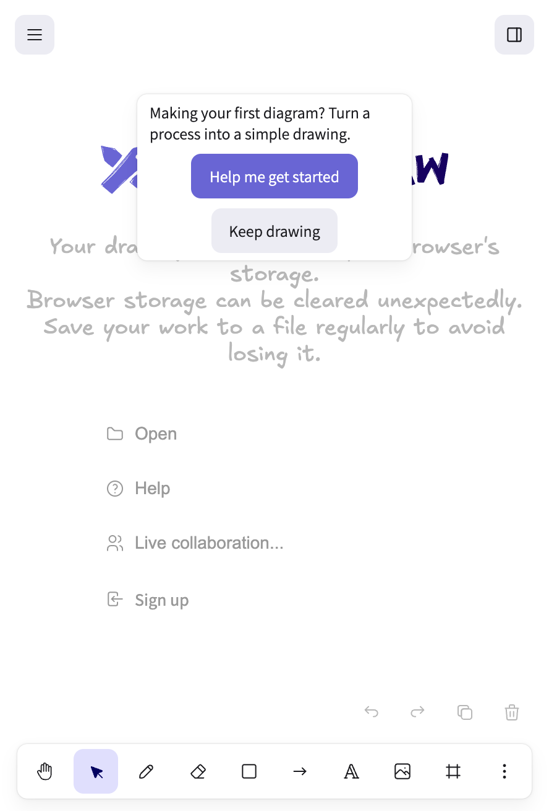
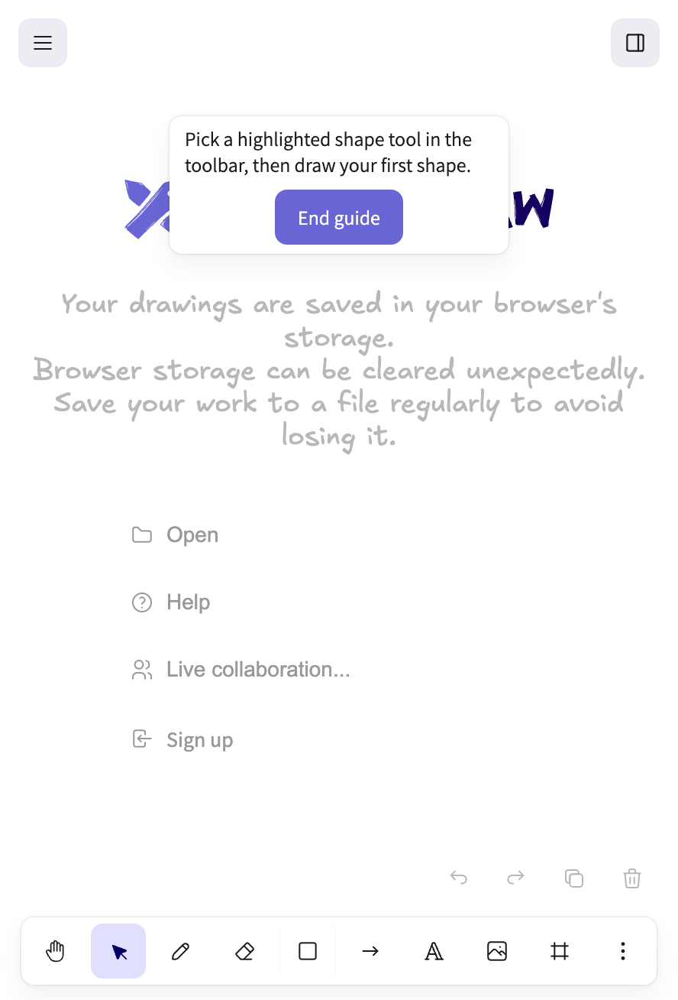

# Build Portfolio

**Feature name:** Canvas Quick-Start Guide
**Team:** Lebert McDonald, Jason Zeng, Mofazzal Hossain
**Client:** Head of Product
**Date:** September 23, 2026

## 1. What We Built

A first-time visitor to Excalidraw now sees a small card at the top of the canvas: “Making your first diagram? Turn a process into a simple drawing.” Two buttons sit next to that line — **Help me get started** and **Keep drawing**. Nothing is blocked. They can ignore the card and start drawing immediately.

If they opt in, the card walks them through one useful first drawing: pick a shape, name it, connect two shapes with an arrow, then save a copy. Each hint goes away the moment they do that step themselves. If they already know what they’re doing, the card leaves on the first mark they make. They can also press **End guide** at any time.

This is not a slideshow tutorial. It reacts to what is actually on the canvas, and it stays out of the way of anyone who has used Excalidraw in this browser before.

## 2. Why We Built It

Your brief asked for **first-session activation**: the share of new signups who complete and save a first drawing in their first session. The working hypothesis was that some new people land on a blank canvas, understand they want a diagram, and still stall before that first useful drawing — even though Excalidraw already has a welcome screen.

The guide is aimed at that stretch of the session, not at teaching the whole product. The four hints match the four places a first drawing usually dies: never picking a tool, drawing a box with no name, never connecting the boxes, or never realizing the work can be saved.

We also treated “do no harm” as part of the same KPI. A guide that slows people who were going to succeed anyway is working against activation. So a returning guest never sees it, a person who starts drawing without clicking anything never has to dismiss a modal, and we never count an automatic browser save of an untouched canvas as a completed first drawing.

We do not have Excalidraw’s internal funnel numbers, so we cannot claim a measured lift. What we can say from using the build ourselves: a new browser can go from a blank canvas to a labeled, connected, explicitly saved drawing without leaving the editor, and a user who ignores the card is not delayed.

## 3. How It Works

This is the path a first-time visitor sees. We walked it on the live app on September 23, 2026.

**Landing.** A new browser (no saved drawing, no library, no prior guide) gets the prompt above. The canvas is already usable. A returning browser skips the prompt entirely.

**Opt in.** **Help me get started** starts the guide. **Keep drawing** ends it. There is no third required click.

**Shape.** The card says: “Pick a highlighted shape tool in the toolbar, then draw your first shape.” Rectangle, diamond, and ellipse pulse on the toolbar. Drawing any of those (or another authored mark — line, arrow, text, freehand) completes the hint. An imported image does not.

**Label.** The card says: “Double-click a shape to name this step.” The hint only completes when the name is actually attached to the shape — stray text on the canvas does not count. Selecting the shape and pressing Enter works the same way.

**Connect.** The card says: “Draw an arrow to connect two shapes.” The arrow tool pulses. The hint completes when the arrow joins two *different* shapes. A stray arrow on empty canvas, or an arrow that loops back to the same shape, does not count. Starting the drag on a label still counts, because that is what the previous hint just taught them to create.

**Save.** The card first says the drawing already auto-saves in this browser, and asks them to use the menu to keep a copy. The hamburger menu pulses. Opening the menu moves the pulse to **Save**, and the card changes to “Now click Save to keep a copy of your drawing.” Menu Save, Cmd+S, or an export all finish the hint. The automatic local save that Excalidraw already does in the background does not.

**If they want out.** **End guide** is on every card. After that, **Help → Show guide** starts the chain over from the first hint, without treating the existing drawing as if they just completed those steps. Reloading halfway through puts them back on the next unfinished hint, not out of the guide.

**If someone else is drawing in the same room.** A collaborator’s shapes do not complete the local user’s hints and do not dismiss the prompt. Only what this person draws counts.

## 4. What's Left

**We cannot yet tell you whether activation moved.** Event tracking was planned for the last day of the build and was cut so the live loop would stay reliable. The event names exist in the code and are unused. Until those fire — eligibility, exposure, opt-in, first authored action, save outcome — and fire the same way for a control group, this is a working product, not a measured experiment. Feature usage alone is not success; your brief said that, and we agree.

**Two definitions are still yours to lock.** We still need which session-reset reading is official (first session only, this attempt, or a later window), and which save surface counts (this browser’s local copy vs. Excalidraw+ cloud). Until those are confirmed, “complete and save a first drawing” is implemented as an explicit save in the free editor, not as a signed-off metric.

**No baseline, so no target.** The “+10 points” figure in the PRD is still a placeholder. We do not know what share of new signups currently stall at the step this guide addresses.

**Intentionally not in this version**

- A separate onboarding path for someone who joins another person’s canvas. Called out as a later initiative; we did not pretend the first-timer path covers them.
- Dismissing one hint while keeping the rest of the guide. **End guide** is all-or-nothing.
- Personalized or role-based paths.
- Any claim that a classroom or teammate walkthrough is production proof.

**What we would do first next time**

1. Wire the analytics events (metadata only — no drawing text, images, or scene contents) and run them for both control and treatment.
2. Confirm the official activation definition with you, then report against that number, not against opt-in rate.
3. Watch a handful of real first sessions to see which of the four hints people actually stall on, and drop or rewrite the ones that do not earn their keep.

## 5. Relevant Links

- Team repo: [https://github.com/lebertmcdonald-afk/Canvas-Quick-Start-Guide--Excalidraw](https://github.com/lebertmcdonald-afk/Canvas-Quick-Start-Guide--Excalidraw)
- This portfolio (team copy): [https://github.com/lebertmcdonald-afk/Canvas-Quick-Start-Guide--Excalidraw/blob/main/docs/Build-Portfolio.md](https://github.com/lebertmcdonald-afk/Canvas-Quick-Start-Guide--Excalidraw/blob/main/docs/Build-Portfolio.md)
- Product requirements: [docs/Canvas Quick-Start Guide PRD.pdf](Canvas%20Quick-Start%20Guide%20PRD.pdf)
- Feature roadmap: [docs/Canvas%20Quick-Start%20Guide%20-%20Feature%20Roadmap.pdf](Canvas%20Quick-Start%20Guide%20-%20Feature%20Roadmap.pdf)
- Demo recording: not recorded. The screenshots above are from a live first-visit pass on the current `main` build, September 23, 2026. The remaining steps in section 3 were walked on the same build in earlier live passes (label → connect → save, Help restart, reload resume).
